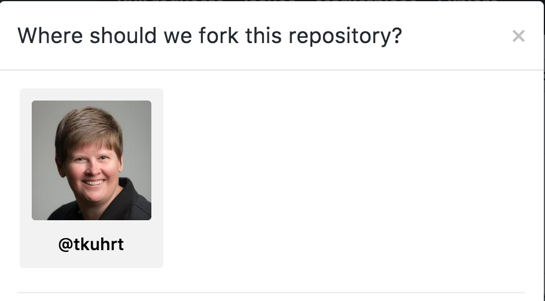

### Fork the Repo
From the Github interface, click on the fork button 


### Fork the Repo - Choose Location



### Ensure Git environment variables match your Github profile
Verify that your user name and email in your local git environment match what you have in Github
```bash
git config user.name
git config user.email
```


### Update Git environment variables
You can set these variables with the following
```
git config user.email "email@example.com"
git config user.name "Mona Lisa"
```

  * Replace **_email@example.com** with the email matching your Github profile
  * Replace **_Mona Lisa_** with the name matching your Github profile

---
`git config --global` will change all repositories


### Clone the Repo
```bash
git clone https://github.com/user/repo
```

  * Replace **_user_** with your username
  * Replace **_repo_** with the name of the repository forked


### Create a branch for your work
```bash
git checkout -b branch-name
```
  * Replace **_branch-name_** with a meaningful name for your work


### Modify Source Code
  * Using your favorite editor, modify your source code
  * Verify that you made the changes you intended

    ```bash
    git diff
    ```


### Commit Source Code
```bash
git add .
git commit -s -m "description of changes made"
```
  * The `-s` option will sign the commit, which is **required** by all Hyperledger repositories
  * Change `description of changes made` to a short description of the changes you made. Make sure you follow the requirements specified by the project's CONTRIBUTING guide


### Retrieve latest changes from upstream
Check to see if you already have an `upstream` remote
```bash
git remote -v
```

```bash
origin	https://github.com/tkuhrt/hyperledgerwp (fetch)
origin	https://github.com/tkuhrt/hyperledgerwp (push)
upstream	https://github.com/hyperledger/hyperledgerwp.git (fetch)
upstream	https://github.com/hyperledger/hyperledgerwp.git (push)
```


### Retrieve latest changes from upstream
If you do not already have an upstream remote, create one using
```bash
git remote add upstream https://github.com/hyperledger/repo
```
  * Replace **_repo_** with the name of the repository forked


### Retrieve latest changes from upstream
Fetch from the upstream remote
```bash
git fetch upstream
git rebase -i upstream/master
```
Resolve any merge conflicts


### Push changes to user's Github
```bash
git push origin branch-name
```
  * Replace **_branch-name_** with name of branch where you made your changes


### Create a Pull Request
Create a new pull request by visiting `https://github.com/user/repo` and clicking on the new pull request button


  * Replace **_user_** with your username
  * Replace **_repo_** with the name of the repository forked


### Create a Pull Request - Verify Changes
Verify that the pull request contains your commits and that all commits are signed off


### Forgot to sign off
If you only have one commit, you can modify that commit using the `--amend` command-line option
```bash
git commit --amend -s
```


### Forgot to sign off
If you have multiple commits, it is best to squash your commits into a single commit and signoff that single commit
```bash
git rebase -i upstream/master
```
Change the `pick` entries for your changes to `squash` or `fixup`
